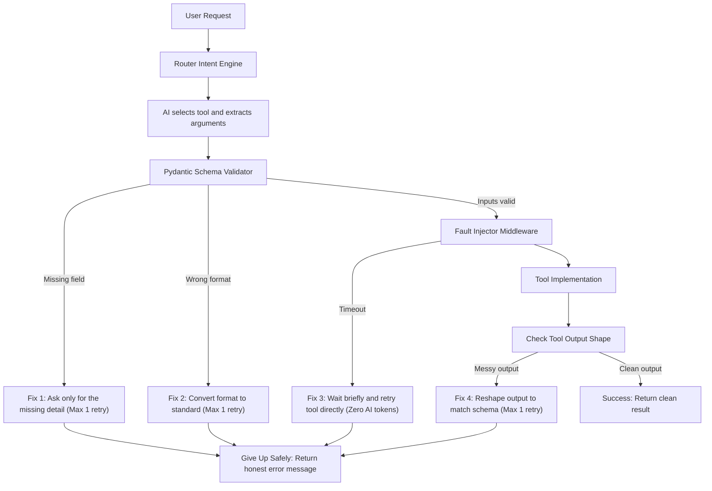

# Project Summary: AI Function-Calling Router with Pydantic & Failure Recovery

---

## 1. What Does This Project Do? (Executive Summary)

This project builds a **production-grade orchestration layer** (or middleware) that sits between an AI model (LLM) and external tools/APIs (such as flight booking, calendars, weather services, or unit converters).

When an AI model calls an external tool, it often makes predictable, real-world mistakes:
- It forgets a required parameter (e.g., forgets the date when booking a flight).
- It provides arguments in human-conversational formats (e.g., `"tomorrow"` or `"one hour"`) instead of strict ISO dates or integers.
- The external server experiences a temporary network timeout.
- The tool executes successfully, but the API response payload is messy or uses scrambled keys.

Most basic AI applications either crash with Python tracebacks or get stuck in wasteful "apology loops" asking the AI over and over to fix itself. 

This project solves this by introducing a **Pydantic validation boundary** and **four targeted, self-healing recovery rules**. Instead of a generic retry, it diagnoses the specific error and applies a surgically targeted fix with a strict 1-retry bound.

---

## 2. What Is the Purpose? (The "Why")

1. **Bridging the Demo-to-Production Gap**: Demos assume "sunny day" scenarios where everything works. Production systems fail constantly. This project provides the engineering architecture to handle failure gracefully.
2. **Eliminating "Silent Wrongness"**: In production, an AI system that claims success while using broken or hallucinated data is worse than an explicit error. This project enforces a **0.0% silent-wrong rate** by validating both tool inputs AND outputs.
3. **Saving AI Token Costs & Latency**:
   - For network timeouts, the system retries the tool function directly with system backoff—spending **zero LLM tokens**.
   - For missing fields, it does not re-send the full conversational history; it asks a **tiny, targeted question** for just the missing field.
4. **Enforcing Strict Limits (No Hallucinated Data)**: Every recovery policy retries at most once. If the service is genuinely down or unrecoverable, it returns an honest, structured error message (`{"status": "error", "reason": "..._unrecoverable"}`) rather than making up a fake confirmation.
5. **Measurable Reliability**: By comparing Baseline Mode (no recovery) against Recovery Mode on 56 benchmark cases, it proves an increase in task completion rate from **60.7% to 94.6%**.

---

## 3. How Each Functionality is Implemented



### 3.1. The Tool Schemas & Pydantic Boundary (`src/schemas.py`)
- Defines four domain tools:
  - **FlightSearch**: Requires `origin` (str), `destination` (str), `date` (ISO date).
  - **CalendarBooking**: Requires `event_title` (str), `start_time` (datetime), `duration_minutes` (int).
  - **WeatherLookup**: Requires `location` (str), `unit` (Enum: `C` or `F`).
  - **UnitConversion**: Requires `value` (float), `from_unit` (str), `to_unit` (str).
- **Two-way typing**: Defines both **Input schemas** (e.g. `FlightSearchArgs`) to validate parameters before calling tools, and **Output schemas** (e.g. `FlightSearchResult`) to validate what the tool returns.
- **Error Classifier (`classify_validation_error`)**: Inspects Pydantic's `ValidationError.errors()` to determine whether an error is `type="missing"` or a type/format failure.

### 3.2. Deterministic Fault Injection Middleware (`src/faults.py`)
- You cannot reliably test recovery by waiting for external APIs to crash.
- Implements an `@inject_fault` decorator wrapping all mock tools.
- Reads `FaultContext.current_fault` (managed via thread-safe `contextvars.ContextVar`) to trigger:
  - `NONE`: Normal execution.
  - `TIMEOUT`: Pauses briefly and raises `TimeoutError` on the first call.
  - `TIMEOUT_PERSISTENT`: Always raises `TimeoutError` to verify safe give-up.
  - `MALFORMED_RESPONSE`: Runs the tool, but corrupts the output dictionary keys (e.g. `{temp_str: "72 degrees"}` instead of `{temperature: 72.0}`).
  - `MALFORMED_PERSISTENT`: Strips critical payload data to test unrecoverable schema repair.

### 3.3. The Routing Engine (`src/router.py`)
- Entry point: `process_request(request, use_recovery, fault, stats)`.
- Step 1: LLM extracts intent and raw arguments from user natural language.
- Step 2: Validates arguments against the tool's Pydantic model.
- Step 3: If validation fails and `use_recovery=True`, dispatches to Policy 1 or Policy 2.
- Step 4: Executes tool via Fault Injector.
- Step 5: If timeout occurs and `use_recovery=True`, dispatches to Policy 3.
- Step 6: Validates tool output against output Pydantic model. If corrupt, dispatches to Policy 4.
- Step 7: Returns standard success dictionary or structured error.

### 3.4. Targeted Recovery Policies (`src/recovery.py` & `src/router.py`)
1. **Missing Field Policy**: 
   - Extracts the exact field name using Pydantic's error `loc`.
   - Sends a focused prompt: `"The tool [Tool] is missing field [Field]. Based on the user request '[Request]', what should this value be? Return only the value."`
   - Merges the extracted value and retries validation.
2. **Type Correction Policy**:
   - Intercepts bad values (like `"tomorrow"` or `"one hour"`).
   - Sends: `"The field [Field] requires format [Format], but you provided [BadValue]. Translate this into the correct format."`
   - Casts value into standard ISO/integer representation.
3. **System Timeout Policy**:
   - Catches `TimeoutError`.
   - Sleeps for `TIMEOUT_BACKOFF_S` (0.1s backoff).
   - Directly re-executes the Python tool function. **No LLM call is made; 0 tokens spent.**
4. **Response Schema Repair Policy**:
   - When tool output fails output schema validation, prompts the LLM: `"The tool returned this malformed payload: [Payload]. Extract the data to match this JSON schema: [Schema]."`
   - Parses the cleaned JSON and validates it against the output Pydantic model.

### 3.5. Bounded Retries & Explicit Give-Up
- Every policy is strictly bounded to **1 retry**.
- If the retry fails, the router never fabricates an answer and never leaks code exceptions. It returns:
  ```json
  {"status": "error", "reason": "<failure_class>_unrecoverable"}
  ```
  (e.g., `timeout_unrecoverable`, `missing_field_unrecoverable`, `schema_repair_unrecoverable`).

### 3.6. Batch Evaluation Harness (`evaluate_router.py`)
- Evaluates 56 diverse requests from `data/eval.jsonl` in both Baseline Mode (`use_recovery=False`) and Recovery Mode (`use_recovery=True`).
- Computes three core metrics:
  - **Completion Rate**: `Validated Successes / Total Requests` (60.7% ➔ 94.6%).
  - **Silent Wrong Rate**: `Unvalidated Successes / Total Requests` (0.0%).
  - **Mean Recovery Attempts**: `Total Retries / Total Requests` (0.39 retries/req).
- Saves results to `output/metrics.json` and full audit trails to `results/run_results.json`.

---

## 4. How Each Technology Used in This Project Helps

| Technology | Role in Project | Why It Matters / How It Helps |
| :--- | :--- | :--- |
| **Pydantic v2** | Validation Boundary & Schema Enforcer | AI models emit text/JSON, but deterministic APIs require strict types. Pydantic validates inputs before execution and outputs after execution. Its granular error metadata (`loc`, `type`) tells our router *exactly* which field broke and why (`missing` vs `type_error`). |
| **Python `contextvars`** | Fault Injection Context Management | Allows test cases and evaluation runners to set fault directives (`TIMEOUT`, `MALFORMED_RESPONSE`) in a thread-safe, request-scoped manner without polluting global state. |
| **OpenAI Python SDK & Pluggable Adapter Layer** | LLM Integration | Powers tool selection and recovery prompts when using live models (GPT-4o, Claude, or local Ollama instances). Structured output and temperature-0 settings keep inferences deterministic. |
| **Deterministic Offline Heuristic Engine** | Default LLM Backend | Stand-in engine that extracts arguments and simulates conversational phrasing (dates as "tomorrow", numbers as "five") without requiring API keys, cloud accounts, or internet access. Guarantees 100% test reproducibility. |
| **Pytest** | Automated Contract Testing | Verifies 37 unit and contract tests across all schemas, fault directives, recovery policies, and edge cases in ~1 second. |
| **Docker & Docker Compose** | Reproducible Containerization | Packages Python 3.11, all dependencies, and the evaluation harness into an isolated image. Allows any evaluator to reproduce the exact metrics on any OS with `docker compose up`. |
| **Mermaid.js & Markdown** | Architectural Transparency | Clear visual diagrams and documentation explaining the exact flow of data through the orchestration layer. |

---

## 5. Key Takeaways & Impact

- **Baseline Completion:** `60.7%` (34 clean requests succeed; 22 requests with missing info, format issues, timeouts, or bad tool replies crash).
- **Recovery Completion:** `94.6%` (recovers from all transient faults and conversational phrasing).
- **Silent-Wrong Rate:** `0.0%` (strict output validation prevents hallucinated or corrupt data from ever reaching the user).
- **Token Efficiency:** Timeouts are resolved with 0 AI tokens; missing fields are fixed with tiny, single-parameter re-prompts.
