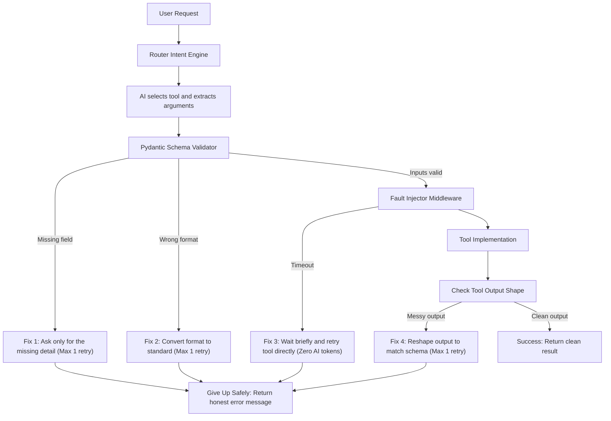

# AI Function-Calling Router with Pydantic & Failure Recovery

When AI models call external tools (like search APIs, calendars, or databases), things often go wrong in real life:
- **Missing details:** The user says *"Book a flight to Paris"*, and the AI forgets to ask for the date.
- **Wrong format:** The AI sends `"tomorrow"` instead of the required date format `"2026-10-04"`.
- **Timeouts:** The tool takes too long to respond or network drops.
- **Messy replies:** The tool succeeds, but its reply shape doesn't match what the app expects.

Most basic apps crash or get stuck in loops apologizing to the user. This project builds a **smart router** that catches these exact errors and fixes them automatically using **targeted recovery rules**.

---

## How It Works

Instead of one generic "retry everything" loop, the system has four separate fix policies:



### The 4 Fix Policies

| Problem | Example | How We Fix It | Retry Limit |
| :--- | :--- | :--- | :---: |
| **Missing Field** | User says *"Book a flight to Paris"* (no date). | Send a tiny prompt asking **only** for the missing date. We don't re-send the whole chat history. | 1 retry |
| **Wrong Format** | AI provides date as `"tomorrow"` or duration as `"one hour"`. | Ask the model to convert that specific value into the expected format (`YYYY-MM-DD` or integer minutes). | 1 retry |
| **Network Timeout** | Upstream API times out. | Wait 0.1s and run the tool function again directly. **No AI tokens are wasted.** | 1 retry |
| **Messy Tool Response** | Tool returns `{temp_str: "72 degrees"}` instead of `{temperature: 72.0}`. | Ask the model to extract and reshape the raw data into our clean output schema. | 1 retry |

### Giving Up Safely (No Fake Successes)

Every recovery rule has a strict **1-retry limit**. If the tool still fails on the second attempt, the router immediately stops and returns an honest, structured error:
```json
{
  "status": "error",
  "reason": "timeout_unrecoverable"
}
```
It **never** invents fake data and **never** leaks messy code errors to the user.

---

## 4 Built-In Tools

1. **FlightSearch**: Search flights (`origin`, `destination`, `date`).
2. **CalendarBooking**: Schedule events (`event_title`, `start_time`, `duration_minutes`).
3. **WeatherLookup**: Check weather (`location`, `unit`: `"C"` or `"F"`).
4. **UnitConversion**: Convert measurements (`value`, `from_unit`, `to_unit`).

---

## Quickstart

### Option 1: Run with Docker (Recommended - 1 Command)

You don't need any API keys. Everything runs fully offline with deterministic test responses:

```bash
docker compose up --build --abort-on-container-exit
```

This will:
1. Build the container and install dependencies.
2. Run the full evaluation harness (`evaluate_router.py`).
3. Save the results directly to `./output/metrics.json` and `./results/run_results.json` on your computer.

### Option 2: Run Locally

```bash
# 1. Create and activate a virtual environment
python3 -m venv .venv
source .venv/bin/activate

# 2. Install dependencies
pip install -r requirements.txt

# 3. Run the evaluation benchmark
python evaluate_router.py

# 4. Run the automated test suite
pytest -v
```

---

## Testing with Injected Faults

To verify our recovery rules without waiting for real web APIs to fail, we built a **Fault Injector** (`src/faults.py`).

Before running a tool, the test can turn on a specific simulated failure:
- `NONE`: Tool runs normally.
- `TIMEOUT`: Tool pauses and throws a `TimeoutError` (simulates a server glitch).
- `TIMEOUT_PERSISTENT`: Tool always times out (tests that the system gives up cleanly).
- `MALFORMED_RESPONSE`: Tool runs but returns scrambled keys (tests schema repair).
- `MALFORMED_PERSISTENT`: Tool returns empty data (tests giving up when repair is impossible).

---

## Benchmark Results

Running `evaluate_router.py` tests 56 varied queries through the system in two modes:
1. **Baseline Mode (No Recovery):** Any missing field, wrong type, timeout, or messy output immediately fails.
2. **Recovery Mode:** The targeted recovery rules are turned on.

### Metrics Summary (`output/metrics.json`)

```json
{
  "baseline": {
    "completion_rate": 0.6071,
    "silent_wrong_rate": 0.0,
    "mean_recovery_attempts": 0
  },
  "recovery_active": {
    "completion_rate": 0.9464,
    "silent_wrong_rate": 0.0,
    "mean_recovery_attempts": 0.3929
  }
}
```

### What these numbers mean:
- **Completion Rate (60.7% ➔ 94.6%):** Turning on recovery policies increased successful task completion by **over 33%**.
- **Silent Wrong Rate (0.0%):** The system **never** told the user a task succeeded when it had bad, broken, or hallucinated data.
- **Mean Recovery Attempts (0.39):** It only takes an average of ~0.39 retries per request to fix failures, keeping execution fast and inexpensive.

---

## Project Structure

```
├── Dockerfile              # Docker image setup
├── docker-compose.yml      # 1-command reproducible container run
├── requirements.txt        # Pinned Python dependencies
├── .env.example            # Environment variables configuration
├── evaluate_router.py      # Batch evaluation script comparing baseline vs recovery
├── data/
│   └── eval.jsonl          # 56 test requests covering all failure types
├── output/
│   └── metrics.json        # Output score comparison file
├── results/
│   └── run_results.json    # Detailed step-by-step audit logs of every test case
├── src/
│   ├── schemas.py          # Pydantic input and output models for all 4 tools
│   ├── faults.py           # Fault injector middleware (TIMEOUT, MALFORMED, etc.)
│   ├── tools.py            # The 4 mock tool implementations
│   ├── router.py           # Core routing and recovery engine
│   ├── recovery.py         # Recovery policy prompt templates
│   ├── llm.py              # LLM adapters (Offline deterministic + OpenAI compatible)
│   └── config.py           # Pinned configuration settings
└── tests/
    ├── test_schemas.py     # Schema validation tests
    ├── test_faults.py      # Fault injector tests
    └── test_router.py      # Recovery policy and end-to-end routing tests
```

---

## Requirement Checklist

| Requirement | What It Does | Where to Find It |
| :--- | :--- | :--- |
| **req-1** | 4 tools with Pydantic input and output validation | [`src/schemas.py`](src/schemas.py), [`tests/test_schemas.py`](tests/test_schemas.py) |
| **req-2** | Fault injector for timeouts, malformed replies, and passthrough | [`src/faults.py`](src/faults.py), [`tests/test_faults.py`](tests/test_faults.py) |
| **req-3** | Smooth path: clean requests succeed with 0 retries | [`src/router.py`](src/router.py), [`tests/test_router.py`](tests/test_router.py) |
| **req-4** | Missing fields: tiny targeted re-prompt for missing detail | [`src/router.py`](src/router.py), [`src/llm.py`](src/llm.py) |
| **req-5** | Wrong format: translate bad values (e.g. "tomorrow" to ISO date) | [`src/router.py`](src/router.py), [`src/llm.py`](src/llm.py) |
| **req-6** | Timeout: wait and retry directly without using AI tokens | [`src/router.py`](src/router.py) |
| **req-7** | Response repair: fix scrambled tool outputs to match schema | [`src/router.py`](src/router.py), [`src/llm.py`](src/llm.py) |
| **req-8** | Explicit give-up: clean error message after 1 failed retry | [`src/router.py`](src/router.py) (`_fail`) |
| **req-9** | Evaluation harness: compares baseline vs recovery on 50+ cases | [`evaluate_router.py`](evaluate_router.py), [`data/eval.jsonl`](data/eval.jsonl) |
| **req-10** | Containerization: runs completely with `docker compose up` | [`docker-compose.yml`](docker-compose.yml), [`Dockerfile`](Dockerfile) |
