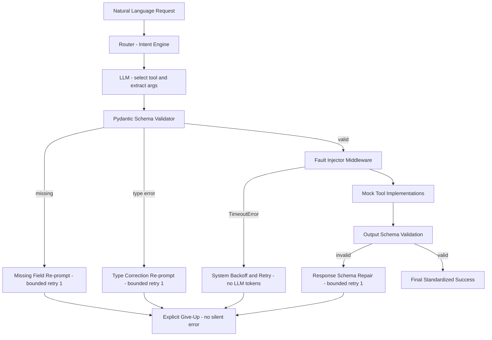

# AI Function-Calling Router with Pydantic and Injected Failure Recovery

A production-shaped function-calling orchestration layer: natural-language requests are
routed to one of four typed tools, validated at a **Pydantic boundary**, executed through a
**fault-injection middleware**, and repaired by **four distinct, bounded recovery policies**
(one per failure class) with an **explicit give-up** instead of silent wrongness.



## Quickstart (one command, fully offline)

```bash
docker compose up --build --abort-on-container-exit
# -> container installs deps, runs evaluate_router.py, exits 0
# -> ./output/metrics.json and ./results/run_results.json appear on the host
```

No API key is needed: the default LLM backend (`LLM_PROVIDER=offline`) is a deterministic
heuristic stand-in with the same four call shapes as a real LLM client. To use a real
OpenAI-compatible model, copy `.env.example` to `.env` and set `LLM_PROVIDER=openai`,
`LLM_API_KEY`, and the pinned `LLM_MODEL_ID`.

## Quickstart (local)

```bash
python3 -m venv .venv
.venv/bin/pip install -r requirements.txt
.venv/bin/python evaluate_router.py     # writes output/metrics.json
.venv/bin/pytest -q                     # contract tests for req-1..req-8
```

## Metrics

`output/metrics.json` (contract shape):

```json
{
  "baseline":        {"completion_rate": ..., "silent_wrong_rate": ..., "mean_recovery_attempts": 0},
  "recovery_active": {"completion_rate": ..., "silent_wrong_rate": ..., "mean_recovery_attempts": ...}
}
```

- **Completion rate** — requests ending in a validated, schema-compliant success payload.
- **Silent wrong rate** — requests that *claimed* success but whose payload violates the
  output schema (audited independently of the router's own validation). Strict output
  validation plus the explicit give-up drives this to 0; a baseline system that passes bad
  API data through would score > 0 here.
- **Mean recovery attempts** — retry actions / total requests.

Per-case rows (status, policies triggered, attempts) are in `results/run_results.json`,
so every number is recomputable from logged intermediates.

## The four failure classes and their DISTINCT policies

| Failure class | Provoked by | Policy (in `src/recovery.py`, implemented in `src/router.py`) | Retry bound |
|---|---|---|---|
| Missing required field | request omits info ("Book a flight to Paris.") | tiny re-prompt for **only** the missing field, merged + retried | 1 |
| Wrong type / format | loose phrasing ("tomorrow", "one hour", "five") | re-prompt to translate the bad value into the required format | 1 |
| Timeout / transient outage | `injected_fault: TIMEOUT` | system-level backoff + direct Python retry — **zero LLM tokens** | 1 |
| Malformed tool response | `injected_fault: MALFORMED` | re-prompt to extract the corrupted payload into the output schema | 1 |

After the bound, the router returns exactly
`{"status": "error", "reason": "<failure_class>_unrecoverable"}` — never a fabricated
success, never a stack trace (`missing_field_unrecoverable`, `type_error_unrecoverable`,
`timeout_unrecoverable`, `schema_repair_unrecoverable`).

The fault injector (`src/faults.py`) supports `NONE`, `TIMEOUT` (transient),
`TIMEOUT_PERSISTENT`, `MALFORMED` (transient, payload still repairable), and
`MALFORMED_PERSISTENT` (data destroyed → exercises the explicit give-up).

## Dataset

`data/eval.jsonl` — 56 cases across the four tools. 34 sunny-day cases; 22 (≈39%) encounter
a failure requiring recovery: 5 missing-field, 5 wrong-type, 5 transient timeout,
2 persistent timeout, 4 repairable malformed, 1 unrecoverable malformed. Missing-field and
wrong-type cases are provoked **natively** by the phrasing (omitted dates, "next Tuesday",
"one hour"), not injected.

## Pinned configuration

Everything that can move a number is pinned via `.env.example` / `src/config.py`:
`EVAL_TODAY` (reference date for relative dates), `LLM_PROVIDER`, `LLM_MODEL_ID`,
`TIMEOUT_BACKOFF_S`. Re-running the harness with the same pins reproduces the same metrics.

## Requirement map

| Requirement | Where |
|---|---|
| req-1 tool schemas | `src/schemas.py`, `tests/test_schemas.py` |
| req-2 fault injector | `src/faults.py`, `tests/test_faults.py` |
| req-3 happy path | `src/router.py`, `tests/test_router.py::test_happy_path_no_recovery_triggered` |
| req-4 missing-field policy | `src/router.py`, `src/llm.py::fill_missing_field` |
| req-5 type-error policy | `src/router.py`, `src/llm.py::correct_type` |
| req-6 timeout policy (no LLM) | `src/router.py` (backoff + direct retry) |
| req-7 schema repair | `src/router.py`, `src/llm.py::repair_schema` |
| req-8 explicit give-up | `src/router.py::_fail` |
| req-9 evaluation harness | `evaluate_router.py`, `data/eval.jsonl`, `output/metrics.json` |
| req-10 containerized run | `Dockerfile`, `docker-compose.yml` |
